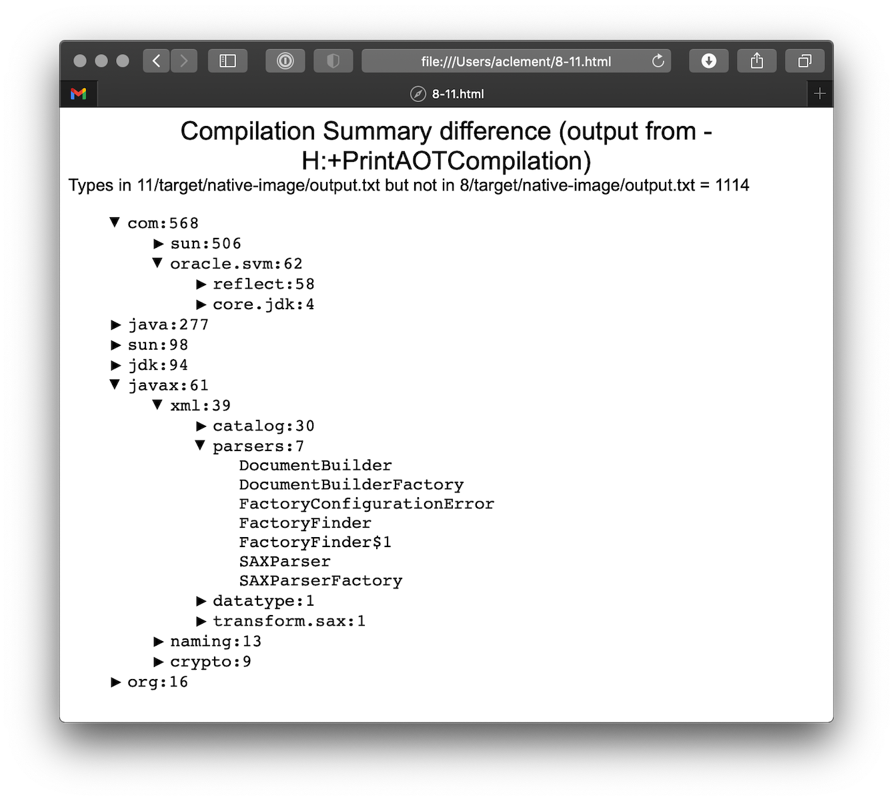

== Scripts

The `native-image` command supports a number of flags for producing information about what is in an image. However, what
can sometimes be really useful is comparing two images. What is in one that isn't in the other? Sometimes sifting through
the ton of output is tricky. The scripts folder provides some tools to help with this.

=== Comparing images

First up is `-H:+PrintAOTCompilation` which prints logging information during compilation, looking a bit like this:

----
Compiling FieldPosition[] java.text.DecimalFormat.getNegativeSuffixFieldPositions()  [Direct call from StringBuffer DecimalFormat.subformat(StringBuffer, Format$FieldDelegate, boolean, boolean, int, int, int, int)]
Compiling FieldPosition[] java.text.DecimalFormat.getPositiveSuffixFieldPositions()  [Direct call from StringBuffer DecimalFormat.subformat(StringBuffer, Format$FieldDelegate, boolean, boolean, int, int, int, int)]
----

Thousands and thousands of lines typically. Typically we turn on that option for `native-image` in the `pom.xml` or in the `compile.sh`
(depending on the sample). The output is produced to stdout which our samples capture in `target/native-image/output.txt`. With two
builds done, we can use a script from this folder to produce a tree diff:

----
compilationDiff.sh java8build/target/native-image/output.txt java11build/target/native-image/output.txt 8-11.html
----

The inputs are the two collected PrintAOTCompilation outputs to compare and the name for an HTML
file that should be generated (this will contain the navigable tree). Then simply open the HTML file.

One of the key entries to look at in the diff is under the path `com/oracle/svm/reflect` as that shows
the entries included due to reflection.
