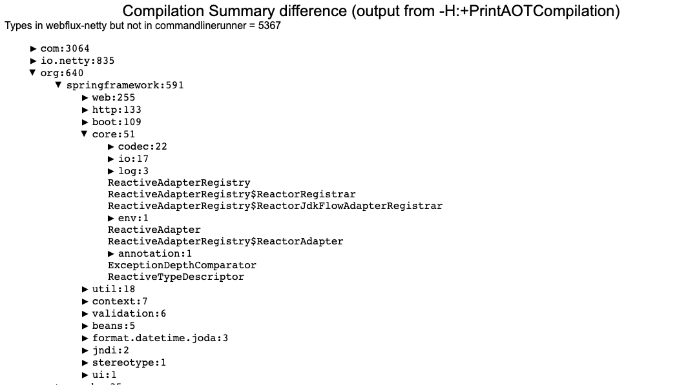
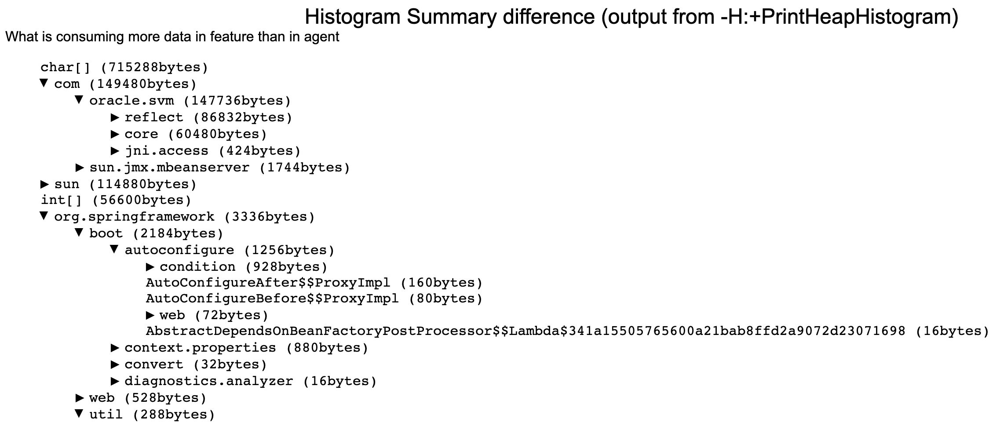

Some tools useful for exploring configuration files and native-image output.

== Comparing PrintAotCompilation output:

How to use:

For the native-image commands that build your images, add the -H:+PrintAOTCompilation option. This will
include lots of 'Compiled...' messages in the output, send that to a file.

Once you have the pair of files you want to compare, run the diff tool and specify, as the final parameter, where you
want the self-contained HTML report. The 'words' before the ':' for the first two parameters are arbitrary and are just short names
used in the HTML report.

`scripts/compilationDiff commandlinerunner:file1.txt webflux-netty:file2.txt codediff.html`

== Comparing PrintHeapHistogram output:

How to use:

For the native-image commands that build your images, add the -H:+PrintHeapHistogram option. This will
produce a bunch of histogram entries in the standard output, send that to a file. The tool is going to look at the 'Total' section
in the histogram data.

Once you have the pair of files you want to compare, run the diff tool and specify, as the final parameter, where you
want the self-contained HTML report. The 'words' before the ':' for the first two parameters are arbitrary and are just short names
used in the HTML report.

`scripts/histogramDiff commandlinerunner:file1.txt webflux-netty:file2.txt diff.html`

